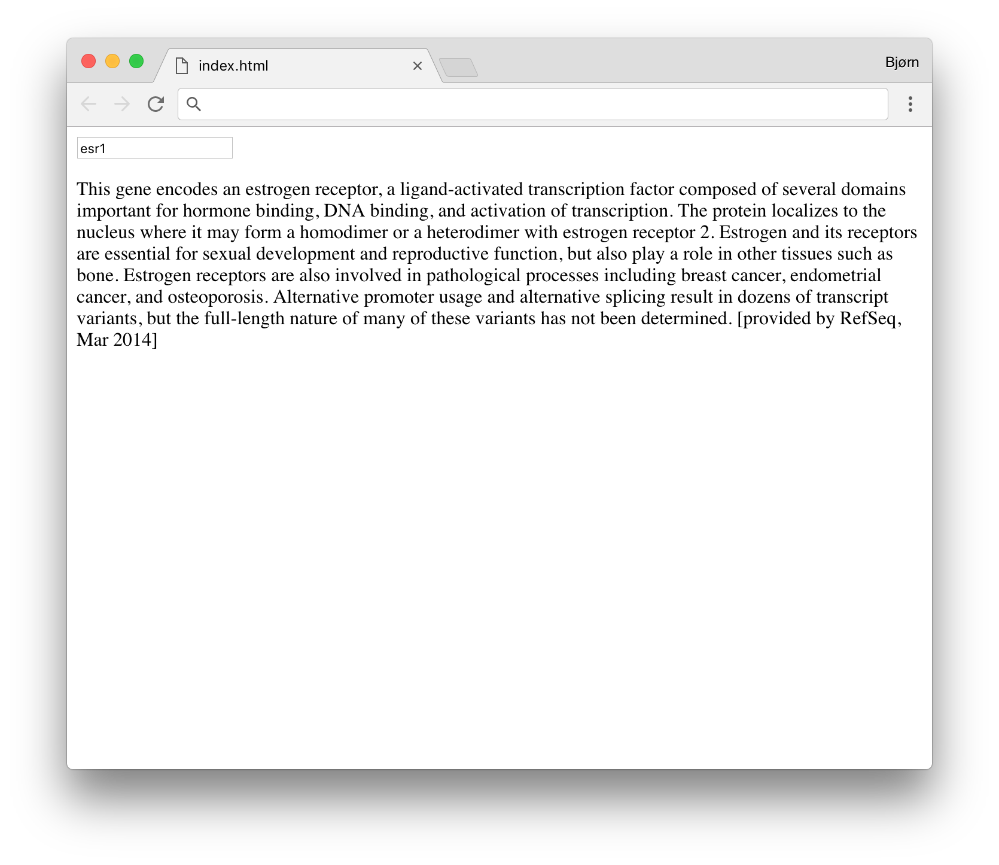

# summaries-js 
[Summaries](http://github.com/fjukstad/summaries) as a web app! Simple test to
try out [GopherJS](https://github.com/gopherjs/gopherjs), and it works pretty
good! 

# How to run? 
Clone down the repository and open [index.html](index.html) in a browser. Just
type in the gene symbol you're interested in in the input field and press enter
to get its summary.

 

# GopherJS? 
GopherJS compiles [summaries.go](summaries.go) to [summaries.js](summaries.js)
(`gopherjs build summaries.go -o summaries.js`) and makes it possible to write
front-end code in Go! 
